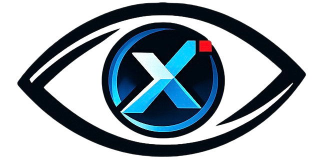
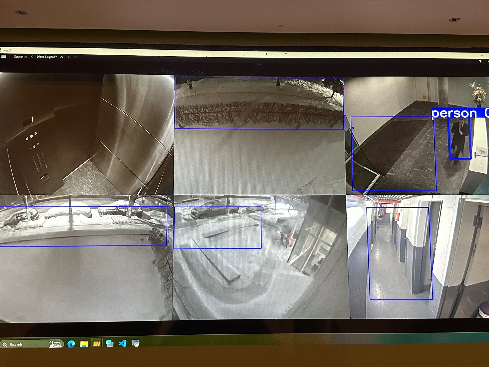
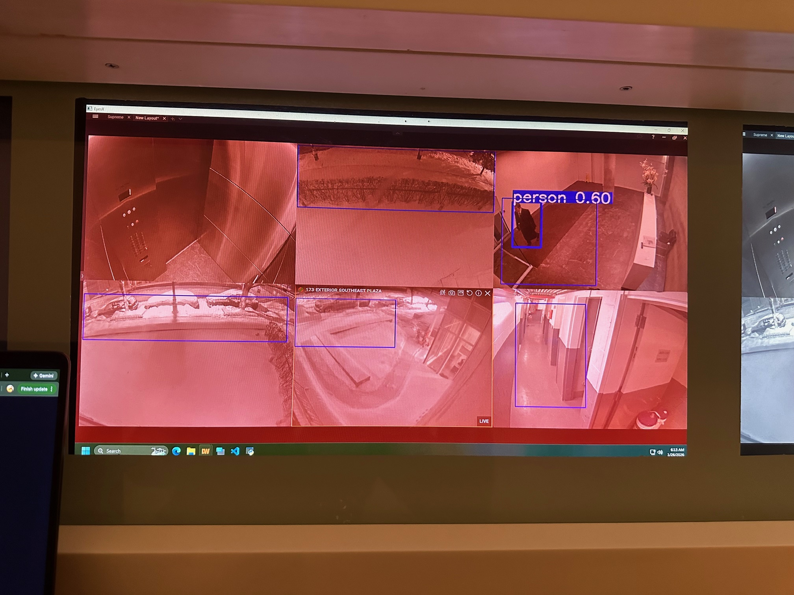
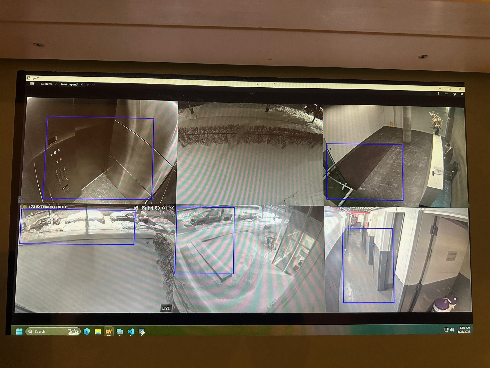
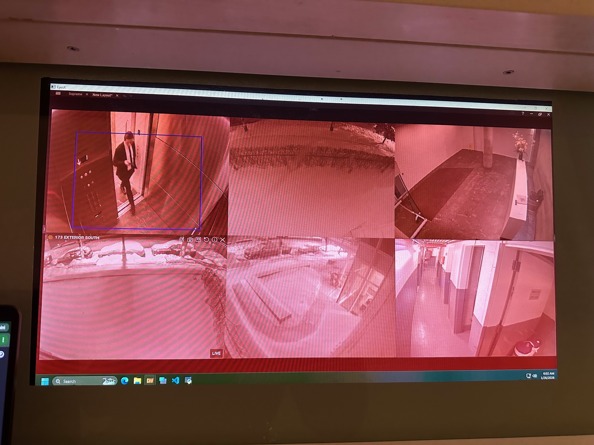

  

# EyesX

EyesX is a Python-based motion detection and monitoring system designed for surveillance-style use cases. It allows users to define custom regions of interest (ROIs) directly on a video feed (e.g. a security camera monitor). When movement is detected inside those selected areas, the system visually alerts the user and triggers an alarm.

**The project supports two different detection modes:**

- A **YOLOv8-based** person detection system (accurate but GPU-heavy)
- A **lightweight frame & illumination comparison** system using background subtraction (fgmask)

**Features:**

- Works with live camera feeds or screen captures
- Draw custom detection boxes (ROIs) on the screen
- Visual alert: screen/ROI turns red on detection
- Audio alert when movement is detected inside a box
- Two detection models to choose from (accuracy vs performance)
- Suitable for low-end systems or GPU-powered setups

## YOLOv8 Person Detection (Script: testing.py)

- Uses YOLOv8 for real-time object detection
- Tracks people and cars only
- Triggers an alert only if a detected person moves into a defined box
- High accuracy and fewer false positives

| Motion Not Detected on ROI | Motion Detected on ROI |
|---------------------|-----------------|
|  |  |

## Frame & Light Comparison (fgmask)

- Uses background subtraction and frame differencing
- Detects motion based on pixel and light changes
- Much lighter on system resources
- Can run on CPUs and low-end machines
- May trigger on shadows, lighting changes, or non-human movement

| Motion Not Detected on ROI | Motion Detected on ROI |
|---------------------|-----------------|
|  |  |

## Why I Built EyesX

I built EyesX based on real-world experience (vibe coded it).

While working as a building manager, I noticed a recurring problem:
security personnel were responsible for monitoring multiple camera feeds for long periods of time, and human attention naturally drops. Guards would sometimes get distracted (phones, conversations, fatigue), and as a result, important events were missed.

There were also restricted areas in the building where only authorized personnel were allowed. When someone entered these zones without permission, security guards didn’t always notice it in time, which led to security breaches and potentially dangerous situations.

EyesX was created to solve that gap. Instead of relying solely on constant human attention, the system:

- Actively monitors critical areas only
- Detects movement or unauthorized presence
- Visually alerts guards by changing the screen state
- Triggers an audio alarm to immediately grab attention

The goal is not to replace security staff, but to support them — making sure important events are noticed early, so action can be taken before someone gets hurt or something gets stolen. EyesX turns passive camera monitoring into an active alert system, helping security teams react faster and take situations seriously the moment they happen.

